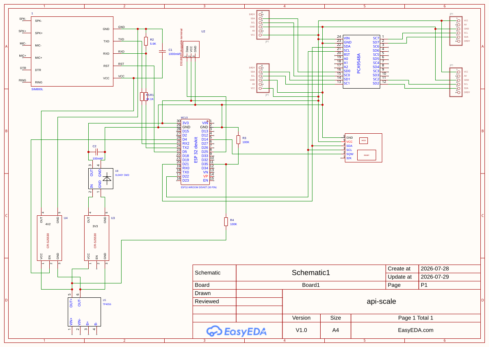

# Smart Hive Scale

Battery-powered beehive weight monitor for remote apiaries. An ESP32 reads four corner load cells, wakes on a
wall-clock-aligned schedule, and publishes telemetry to **Home Assistant** over **2G GPRS** (field) or **WiFi**
(at home).

Discrete build: bare **ESP32-WROOM-32**, standalone **SIM800L** (own UART/power wiring, no integrated PMIC),
**4 corner load cells** each behind its own **NAU7802** ADC, fanned out over a **PCA9548A** I2C mux, a **DS3231**
precision RTC driving the wake schedule, and a **TP4056 + 2× CR-SJ5530** power chain. Deep-sleep power
management and a web config portal for calibration and settings without reflashing.

## Features

- 4-corner weight measurement — per-corner tare, one shared span calibration (serial or web portal)
- MQTT JSON telemetry (`weight_kg`, `stable_kg`, `corner1_kg`..`corner4_kg`, `temp_scale_c`, battery, GSM/WiFi
  status, cell tower IDs)
- **GSM mode** — TLS MQTT over public IP (port 8883) for field hives
- **WiFi mode** — plain MQTT on LAN (port 1883) when the hive is at home
- Deep sleep between reports, wall-clock aligned via DS3231 (default every 6 hours, configurable)
- Setup button → WiFi AP config portal (calibration, broker, OTA firmware update)
- Home Assistant integration via MQTT sensors (one device per hive)

## Quick start

```bash
git clone <repo-url> beekpr-weights
cd beekpr-weights
cp .env.example .env          # edit MQTT credentials and broker host
python3 -m venv .venv
.venv/bin/python -m pip install -U pip platformio
.venv/bin/pio run -t upload
.venv/bin/pio device monitor -b 115200
```

See **[Local development setup](doc/local-setup.md)** for wiring, calibration, and bench commands.

## Documentation

| Guide | Description |
|-------|-------------|
| [**User guide**](doc/user-guide.md) | End-to-end: 4-corner calibration, MQTT, Home Assistant, daily use |
| [**Local setup**](doc/local-setup.md) | Build, flash, wiring, serial commands, config portal |
| [**SIM800L hardware**](doc/esp32_sim800l.md) | Standalone SIM800L wiring, power control, bring-up |
| [**MQTT & TLS setup**](doc/mqtt-tls-setup.md) | Mosquitto certificates, port forward, field device security |
| [**Project specification**](spec.md) | Requirements, architecture, BOM, wiring, calibration procedure |
| [**Bring-up & migration record**](doc/rework-implementation-plan.md) | Phase-by-phase history of the T-Call → discrete migration |
| [**Home Assistant YAML**](doc/home-assistant/mqtt_sensors.yaml) | MQTT entities grouped under one device per hive |

## Hardware

- ESP32-WROOM-32 + standalone SIM800L + 2G SIM (nano)
- 4× 40 kg load cell, each behind its own NAU7802 (I2C 0x2A) on a PCA9548A mux (0x70) — shared bus GPIO 21/22
- DS3231 precision RTC (0x68, same bus) — drives the wall-clock-aligned wake schedule
- DS18B20 temperature sensor on the scale frame (DQ **GPIO 25**, 4.7 kΩ pull-up to 3.3 V)
- TP4056 Li-Ion charger + 2× CR-SJ5530 buck-boost (3.3 V logic rail, 4.2 V modem rail)
- Li-Ion battery (3000–6000 mAh recommended — the charger cannot power the board on its own; see
  [local-setup.md](doc/local-setup.md) for why a battery must always be connected), outdoor enclosure, GSM antenna
- Setup button (GPIO 13 → GND)



Pin map, mechanical notes, BOM, and full wiring tables: [spec §10](spec.md#10-hardware-connections) and
[local-setup wiring](doc/local-setup.md#wiring).

For the retired TTGO T-Call V1.3/V1.4 firmware (single load cell, integrated PMIC — no longer built or
supported), see the `tcall-v1` git tag.

## License

See [LICENSE](LICENSE).
