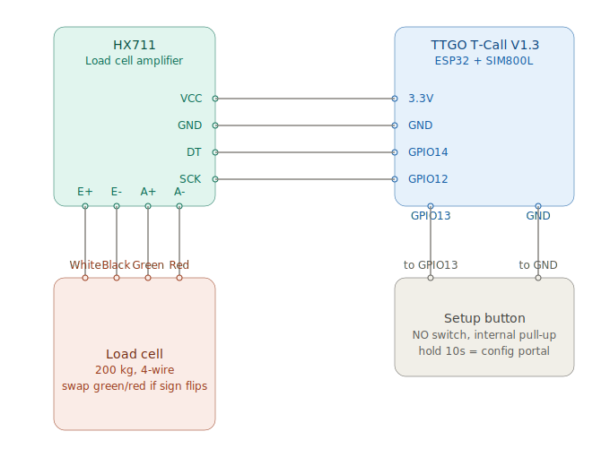

# TTGO T-Call V1.3 — hardware reference

Board used by Smart Hive Scale: ESP32-WROVER-B + SIM800L + IP5306 PMIC.

## Pinout

## Wiring (this project)

| Connection | Pins |
|------------|------|
| HX711 DT | GPIO 14 |
| HX711 SCK | GPIO 12 |
| HX711 VCC / GND | 3.3 V / GND |
| Setup button | GPIO 13 ↔ GND (NO, internal pull-up) |
| Battery sense | GPIO 35 (ADC, onboard) |

**Reserved — do not use for sensors:** GPIO 4, 5, 21, 22, 23, 26, 27 (modem + PMIC).

## Official resources

- [LilyGO T-Call SIM800 (GitHub)](https://github.com/xinyuan-lilygo/lilygo-t-call-sim800)
- Full tables: [`local-setup.md` — Wiring](local-setup.md#wiring)
- Project spec: [`spec.md` §10](../spec.md#10-hardware-connections)
