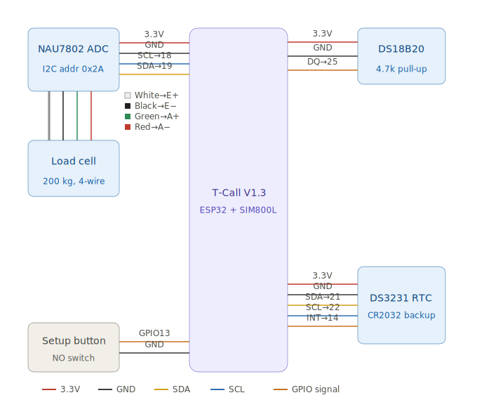
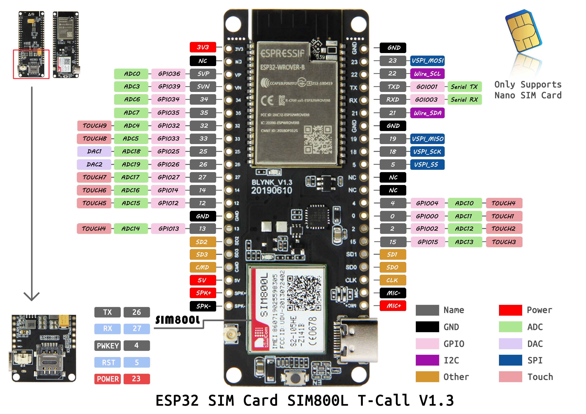

# Smart Hive Scale — Project Specification

## 1. Purpose

A battery-powered field device that measures beehive weight and periodically reports telemetry to Home Assistant over cellular 2G. The device spends most of its time in deep sleep to conserve energy.

**Scope (v1):** weight only, one device per hive. Architecture allows adding more sensors later (temperature, humidity, etc.).

## 2. Confirmed Decisions

| Decision | Value |
|----------|-------|
| Hardware board | TTGO T-Call V1.3 (ESP32-WROVER-B + SIM800L) |
| Load cell | YZC-1B 200 kg + NAU7802 24-bit I2C ADC |
| Power | Li-Ion battery via DC-DC / board PMIC |
| Cellular | 2G GSM/GPRS (best coverage in Ukraine) |
| Home connectivity | **WiFi STA** optional (hive at home on LAN) |
| Maintenance | **Setup button** (10s hold) → WiFi AP config portal |
| SIM operator | Kyivstar (default APN); configurable for other operators |
| Devices | One device per hive |
| Report schedule | 4 times per day (every 6 hours) |
| Firmware stack | PlatformIO + Arduino framework |
| MQTT broker access | Router **port forward** to home static IP |
| Public address | **Static white IP** (no domain name) |
| MQTT transport | **TLS on port 8883** (self-signed CA) |
| MQTT auth | Username + password per hive device |
| Device ID (first hive) | `hive-01` |
| Secrets management | `.env` (gitignored); `certs/ca.pem` (gitignored) |
| Home Assistant | Local broker `127.0.0.1:1883`; field devices use `STATIC_IP:8883` |

## 3. Functional Requirements

| ID | Requirement |
|----|-------------|
| FR-1 | Measure hive weight with ±0.1–0.5 kg accuracy after calibration |
| FR-2 | Publish weight to MQTT in a Home Assistant–friendly JSON format |
| FR-3 | Wake on RTC timer, transmit, then return to ESP32 deep sleep |
| FR-4 | Report battery voltage each transmission cycle |
| FR-5 | On GSM/MQTT failure: retry with backoff; still enter deep sleep after max retries |
| FR-6 | Operator/APN, broker host, device ID, and schedule configurable without full reflash where practical |
| FR-7 | USB serial logging for bench debugging and calibration |
| FR-8 | **GSM or WiFi STA** connectivity mode, selectable and stored in NVS |
| FR-9 | Setup button (10s hold) opens WiFi AP config portal with calibration, settings, and OTA |
| FR-10 | WiFi and Bluetooth **off by default**; radios enabled only when needed |

## 4. Non-Functional Requirements

| ID | Requirement |
|----|-------------|
| NFR-1 | Target ≥ 2–4 weeks per battery charge (depends on cell capacity) |
| NFR-2 | Outdoor operation in Ukrainian climate |
| NFR-3 | Weather-resistant enclosure (IP65 target) |
| NFR-4 | Modular firmware: sensors, modem, MQTT, power manager as separate units |
| NFR-5 | Kyivstar-first cellular config; easy APN swap for Vodafone, Lifecell, etc. |

## 5. Bill of Materials

### Core

| Part | Role | Notes |
|------|------|-------|
| TTGO T-Call V1.3 | MCU + GSM modem | ESP32-WROVER-B + SIM800L + IP5306 PMIC |
| YZC-1B 200 kg load cell | Weight sensor | 4-wire: E+, E−, S+, S− |
| Adafruit NAU7802 module | 24-bit ADC | I2C 0x2A, 3.3 V, internal bridge LDO |
| DS18B20 | Scale-frame temperature | OneWire GPIO 25, 4.7 kΩ pull-up |
| Li-Ion battery | Power | 18650 or pack, 3000–6000 mAh recommended |
| DC-DC buck converter | Stable supply | Optional if using board JST battery input |
| GSM antenna | 2G RF | Mount outside enclosure |
| Nano SIM | GPRS data | 2G-enabled Ukrainian carrier |

### Recommended

| Part | Role |
|------|------|
| IP65 enclosure | Weather protection |
| Stainless mounting frame | Even load distribution on load cell |
| JST connector / fuse | Serviceable, protected battery wiring |
| Cable glands, silica gel | Moisture management |
| USB cable | Flashing and calibration |

## 6. System Architecture

```
┌─────────────────────────────────────────────────────────────┐
│                     FIELD DEVICE                            │
│                                                             │
│  ┌──────────┐    ┌────────┐    ┌─────────┐    ┌─────────┐  │
│  │ Load Cell│───►│NAU7802 │───►│ ESP32   │◄──►│ SIM800L │  │
│  │ YZC-1B   │    │I2C ADC │    │ WROVER  │    │  Modem  │  │
│  └──────────┘    └────────┘    └────┬────┘    └────┬────┘  │
│  ┌──────────┐                       │                      │
│  │ DS18B20  │──────OneWire──────────┘                      │
│  └──────────┘                                              │
│                                     │               │       │
│                              ┌──────▼───────────────▼──┐    │
│                              │ IP5306 PMIC + Battery   │    │
│                              └─────────────────────────┘    │
└─────────────────────────────────────────────────────────────┘
                              │ 2G GPRS
                              ▼
                    ┌──────────────────┐
                    │ Mobile Network   │
                    │ (Kyivstar, etc.) │
                    └────────┬─────────┘
                             │ MQTT/TLS :8883
                             ▼
                    ┌──────────────────┐
                    │ Router           │
                    │ port forward     │
                    │ :8883 → HA host  │
                    └────────┬─────────┘
                             │
                             ▼
┌─────────────────────────────────────────────────────────────┐
│                         HOME                                │
│  ┌────────────┐      ┌─────────────┐                        │
│  │ Mosquitto  │◄────►│ Home        │                        │
│  │ :1883 local│      │ Assistant   │                        │
│  │ :8883 TLS  │      │             │                        │
│  └────────────┘      └─────────────┘                        │
└─────────────────────────────────────────────────────────────┘
```

### Software Modules

| Module | Responsibility |
|--------|----------------|
| **Config** | Device ID, APN, broker host/port, MQTT credentials, schedule, connectivity mode |
| **Radio Manager** | Disable WiFi/BT at boot; enable only for WiFi TX or AP OTA |
| **Connectivity** | GSM vs WiFi STA mode; WiFi credentials in NVS |
| **Maintenance Portal** | Soft-AP + web UI: calibrate, WiFi/GSM settings, mode, OTA, save & reboot |
| **Power Manager** | Modem power on/off, battery ADC, deep sleep entry |
| **Sensor Manager** | NAU7802 read, averaging, tare, calibration coefficients; DS18B20 temperature |
| **Modem Manager** | SIM800L init, registration, GPRS attach, signal quality |
| **MQTT Client** | TLS connect, publish, graceful disconnect |
| **App Scheduler** | Orchestrates wake → measure → connect → publish → sleep |

### Wake Cycle

1. ESP32 wakes from deep sleep (RTC timer or setup button)
2. NAU7802 power-up + AFE calibration, discard first conversions, then optional **2-minute thermal warm-up** (timer wake only; skipped if already awake ≥2 min)
3. Read battery voltage
4. **If GSM mode:** power on SIM800L, register, attach GPRS, TLS to `MQTT_BROKER_HOST:8883`
5. **If WiFi mode:** connect STA to saved SSID, MQTT to broker LAN IP port **1883** (no TLS)
6. Read NAU7802 (multiple samples, median filter) and DS18B20 temperature, publish JSON telemetry
7. Disconnect MQTT; power off modem; full WiFi shutdown; NAU7802 register power-down
8. Enter deep sleep until next cycle

**Maintenance (config portal):** hold setup button **10 seconds** (or serial `portal`) → soft-AP `beekpr-{device_id}` at `http://192.168.4.1`. Portal is **session-only**; save & reboot returns to gsm/wifi mode. No deep sleep while portal is active.

### Power — radios off by default

| Radio | Normal operation | Notes |
|-------|------------------|-------|
| WiFi | **OFF** (gsm/wifi modes) | Enabled only during WiFi STA TX or config portal session |
| Bluetooth | **Disabled at compile time** | `CONFIG_BT_ENABLED=0` in build |
| SIM800L | **OFF** between cycles | Powered only for connect/publish in gsm mode |

Firmware calls `radioPowerDown()` on every boot; WiFi is enabled only when the config portal is active or during WiFi STA transmit (future step).

## 7. MQTT Design

### Topics

```
beekpr/{device_id}/state           → JSON (primary)
beekpr/{device_id}/availability    → online | offline
```

Example `device_id`: `hive-01`

### Payload (JSON)

```json
{
  "weight_kg": 47.32,
  "stable_kg": 47.29,
  "temp_scale_c": 18.75,
  "battery_v": 3.87,
  "battery_pct": 78,
  "rssi": 26,
  "wifi_connected": true,
  "wifi_hostname": "beekpr-hive-01",
  "wifi_ip": "192.168.1.42",
  "wifi_rssi": -58,
  "tx_interval_sec": 21600,
  "cell_mcc": 255,
  "cell_mnc": 255,
  "cell_lac": -1,
  "cell_cid": -1,
  "device_id": "hive-01"
}
```

### Home Assistant integration

No custom HA integration is required for v1. Use the built-in **MQTT integration** and **MQTT sensors** subscribed to `beekpr/{device_id}/state`.

#### Prerequisites

- Mosquitto add-on running (local `127.0.0.1:1883`)
- HA MQTT integration configured (Settings → Devices & services → MQTT)
- Device publishing JSON to `beekpr/hive-01/state`

#### Entities to create (per hive)

| Entity | Source field | Platform | Notes |
|--------|--------------|----------|-------|
| Hive weight | `weight_kg` | `sensor` | Primary; `state_class: measurement`, unit `kg` |
| Hive weight (stable) | `stable_kg` | `sensor` | Filtered value; use for graphs/alerts |
| Scale temperature | `temp_scale_c` | `sensor` | DS18B20 on frame; `null` if sensor missing |
| Battery voltage | `battery_v` | `sensor` | `device_class: voltage` |
| Battery charge | `battery_pct` | `sensor` | `device_class: battery`, unit `%` |
| Signal | `rssi` | `sensor` | GSM signal quality (0–31) |
| WiFi connected | `wifi_connected` | `binary_sensor` | `true` / `false` |
| WiFi hostname | `wifi_hostname` | `sensor` | LAN hostname (`beekpr-hive-01`) |
| WiFi IP | `wifi_ip` | `sensor` | Assigned DHCP address |
| WiFi signal | `wifi_rssi` | `sensor` | dBm |
| Cell MCC | `cell_mcc` | `sensor` | Operator/country code |
| Cell MNC | `cell_mnc` | `sensor` | Operator network code |
| Cell LAC | `cell_lac` | `sensor` | Location area code |
| Cell CID | `cell_cid` | `sensor` | Cell tower ID |
| Availability | `beekpr/hive-01/availability` | `binary_sensor` | `online` / `offline` payload |

#### Device grouping

Group all entities under one **device** in HA (e.g. “Hive 01”) via `device` block in MQTT discovery or manual YAML.

#### Optional (Step 10)

- **Utility meter** — daily honey gain from weight delta
- **Statistics** — `min`/`max` over 24 h
- **Automations** — rapid weight drop alert, low battery, device offline
- **Dashboard** — weight history, battery, last seen, cell tower info
- **MQTT command topic** (later) — `beekpr/hive-01/cmd` for `setint`, tracking mode

Config deliverable: [`doc/home-assistant/mqtt_sensors.yaml`](doc/home-assistant/mqtt_sensors.yaml). Full setup guide: [`doc/user-guide.md`](doc/user-guide.md).

## 8. MQTT exposure & TLS

Field devices connect to the home broker via **router port forwarding** on the **static public IP**. No Cloudflare, no extra domain.

Full setup guide: [`doc/mqtt-tls-setup.md`](doc/mqtt-tls-setup.md)

### Summary

| Endpoint | Who | Port | Protocol |
|----------|-----|------|----------|
| `127.0.0.1` | Home Assistant | **1883** | MQTT (local only) |
| `STATIC_IP` (public) | ESP32 in the field | **8883** | **MQTT over TLS** |

### Security

1. **Self-signed CA** — generate `ca.crt` / `server.crt` / `server.key` (OpenSSL)
2. **TLS on 8883** — Mosquitto listener with `certfile`, `keyfile`, `cafile`
3. **MQTT credentials** — unique username/password per hive (`allow_anonymous false`)
4. **Port forward** — only **8883/TCP**; never expose **1883**
5. **Firmware** — embed `certs/ca.pem` (CA trust anchor); validate server cert on connect
6. **Optional later** — mutual TLS (client certificates per device)

### Ukrainian mobile APN defaults

| Operator | APN | User | Password |
|----------|-----|------|----------|
| Kyivstar | `internet` | (empty) | (empty) |
| Vodafone UA | `internet` | (empty) | (empty) |
| Lifecell | `internet` | (empty) | (empty) |

Stored in firmware config; change without recompile when possible (NVS).

## 9. Connectivity modes

| Mode | How to set | MQTT path | When to use |
|------|------------|-----------|-------------|
| **GSM** (default) | Config portal or `setmode gsm` | Public IP `:8883` TLS via GPRS | Remote apiary |
| **WiFi STA** | Config portal or `setmode wifi` | LAN `MQTT_BROKER_WIFI_HOST:1883` | Hive at home |

### Config portal (maintenance)

Triggered by **setup button held 10s** (GPIO 13 → GND) or serial command `portal`.

| Item | Value |
|------|-------|
| AP SSID | `beekpr-{device_id}` |
| AP password | `WIFI_AP_PASSWORD` (default `beekpr-setup`) |
| URL | `http://192.168.4.1` |

Web UI sections (forms prefilled from NVS):

1. **Weight calibration** — live reading, tare, calibrate with known kg
2. **WiFi client** — SSID + password
3. **GSM / SIM** — APN, username, password, cell tower IDs
4. **Operating mode** — GSM or WiFi + report interval
5. **Firmware update** — upload `.bin`
6. **Save settings and reboot**

GSM APN/credentials are stored in NVS (`gsm_settings`) and override compile-time defaults from `.env`.

### Serial commands (bench)

```
modem
gprs
mqtt
setmode gsm|wifi
setwificred MyHomeNet mypassword
portal
show
reboot
```

## 10. Hardware Connections



### TTGO T-Call V1.3 pinout



SIM800L uses GPIO **26** (RX), **27** (TX), **4** (PWRKEY), **5** (RST), **23** (POWER) — onboard, no user wiring. IP5306 PMIC uses **GPIO 21/22** (I2C) — do not repurpose.

### TTGO T-Call V1.3 — onboard (no wiring)

| Signal | GPIO | Notes |
|--------|------|-------|
| MODEM RX (ESP TX) | 27 | UART2 |
| MODEM TX (ESP RX) | 26 | UART2 |
| MODEM PWRKEY | 4 | ≥1 s pulse to power on |
| MODEM RST | 5 | Hardware reset |
| MODEM POWER | 23 | Power enable |
| IP5306 SDA | 21 | I2C — do not repurpose |
| IP5306 SCL | 22 | I2C — do not repurpose |

### NAU7802 → ESP32

| NAU7802 | ESP32 | Notes |
|---------|-------|-------|
| VIN | 3.3 V | |
| GND | GND | |
| SCL | GPIO 18 | Dedicated I2C bus (address 0x2A) |
| SDA | GPIO 19 | GPIO 21/22 are reserved for the PMIC |

### DS18B20 → ESP32

| DS18B20 | ESP32 | Notes |
|---------|-------|-------|
| VDD | 3.3 V | |
| GND | GND | |
| DQ | GPIO 25 | OneWire; **4.7 kΩ pull-up from DQ to 3.3 V required** |

Mount the probe on the scale frame near the load cell; the reading is published as `temp_scale_c`.

### Setup button → ESP32

| Button | ESP32 |
|--------|-------|
| NO contact | GPIO 13 ↔ GND (internal pull-up) |

Hold **10 seconds** to open config portal.

### Load cell → NAU7802

**YZC-1B cell from a scale PCB** (marked `vref` / `gnd` / `np` / `nn`):

| Load cell wire | Old PCB mark | NAU7802 |
|----------------|--------------|---------|
| White | vref | E+ |
| Black | gnd | E− |
| Green | nn | A+ |
| Red | np | A− |

Generic 4-wire cells often use Red→E+, Black→E− — verify with a multimeter if colors differ.

### Power

- **Preferred:** Li-Ion → board JST battery connector (IP5306).
- **Alternative:** Li-Ion → buck 5 V → 5V/GND header; common ground with the sensors.
- Battery sense: GPIO 35 (ADC) if present on board revision.

### Mechanical

Single 200 kg load cell in compression between a fixed base and a top plate under the hive. Frame must constrain lateral movement.

## 11. Firmware Approach

**Selected:** PlatformIO + Arduino + TinyGSM + PubSubClient + SparkFun NAU7802 + DallasTemperature libraries.

| Approach | Verdict |
|----------|---------|
| PlatformIO + TinyGSM + PubSubClient | **Selected** — fast development, good community examples |
| ESP-IDF + PPP | Reserved for future power optimization |
| HTTP REST to HA | Fallback only |

## 12. Implementation Plan

| Step | Goal | Deliverable |
|------|------|-------------|
| 1 | Project scaffold | PlatformIO project, pins, `config.h` — **done** |
| 2 | Scale ADC bench test | Serial raw readings (HX711, later migrated to NAU7802) — **done** |
| 3 | Calibration | Tare + scale in NVS, stability checks — **done** |
| 3b | Radio + maintenance portal | WiFi/BT off, button-triggered AP, web config UI — **done** |
| 4 | Modem test | Network registration, RSSI, cell tower IDs over serial — **done** |
| 5 | GPRS connection | TCP reachability to broker host — **done** |
| 6 | MQTT publish (GSM) | `mqtt` command — TLS publish to Mosquitto :8883 — **done** |
| 6b | MQTT publish (WiFi) | STA connect + publish to LAN broker :1883 |
| 7 | Power management | Modem cycle + ESP32 deep sleep |
| 8 | Full scheduler | End-to-end periodic reporting with configurable interval |
| 9 | Mosquitto TLS + network | [`doc/mqtt-tls-setup.md`](doc/mqtt-tls-setup.md), port forward, certs |
| 10 | Home Assistant integration | MQTT sensors, device, availability, dashboard/automations — **done** ([`doc/user-guide.md`](doc/user-guide.md), [`doc/home-assistant/mqtt_sensors.yaml`](doc/home-assistant/mqtt_sensors.yaml)) |
| 11 | Field hardening | Enclosure, antenna, failure diagnostics |

### Step 9 deliverable (Mosquitto + network)

- Generate CA / server certificates (OpenSSL)
- Configure Mosquitto TLS listener on **8883**
- Keep HA on local **1883** only
- Router port forward **8883** → HA host
- Create per-hive MQTT user credentials
- Verify external publish with `mosquitto_pub` + CA file

### Step 10 deliverable (Home Assistant)

- Enable **MQTT integration** in HA (connect to local Mosquitto)
- Add MQTT sensors for all JSON fields (`weight_kg`, `stable_kg`, `temp_scale_c`, `battery_v`, `rssi`, `cell_*`)
- Add MQTT **availability** binary sensor on `beekpr/{device_id}/availability`
- Register entities under a single **device** per hive
- Create basic **Lovelace dashboard** card (weight + battery + last update)
- Optional **automations**:
  - Notify if weight drops sharply between readings
  - Notify if device offline > 2× `tx_interval_sec`
  - Notify if `battery_v` below threshold
- Commit example config: `doc/home-assistant/mqtt_sensors.yaml`
- Test end-to-end: field device publish → HA entities update
