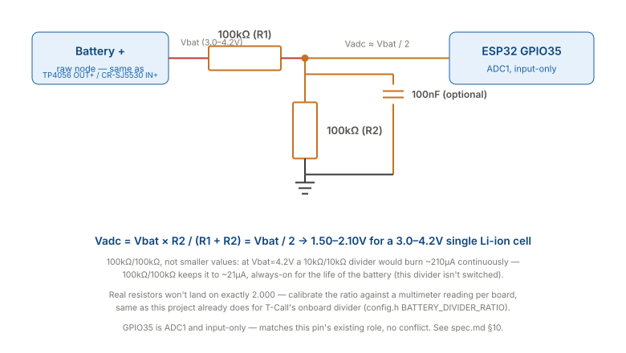
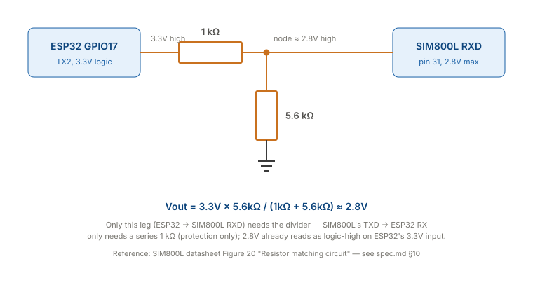

# Smart Hive Scale — Project Specification

## 1. Purpose

A battery-powered field device that measures beehive weight and periodically reports telemetry to Home Assistant over cellular 2G. The device spends most of its time in deep sleep to conserve energy.

**Scope (v1):** weight only, one device per hive, sensed at all 4 corners of the hive stand and summed. Architecture allows adding more sensors later (temperature, humidity, etc.).

## 2. Confirmed Decisions

| Decision | Value |
|----------|-------|
| Hardware board | Discrete build: **ESP32-WROOM-32** + standalone **SIM800L** (no integrated PMIC) |
| Load cells | **4×** Zemic-family 40 kg C3-class cells (one per hive corner), each behind its own NAU7802 |
| Weight ADC | **4× NAU7802** 24-bit I2C ADC, fanned out over a **PCA9548A** I2C mux (NAU7802's address is fixed at 0x2A, so 4 can't share a bus directly) |
| Precision clock | **DS3231** RTC — drives a wall-clock-aligned wake/report schedule (e.g. a 1 h interval always fires at `:00`), not just an interval timer |
| Power | Li-Ion/LiPo battery → **TP4056** charger → **2× CR-SJ5530** buck-boost converters (fixed 5 V/4.2 V/3.3 V taps; 3.3 V logic rail, **4.2 V** modem rail — SIM800L's VBAT range, **not** the 5 V tap, see §10) |
| Cellular | 2G GSM/GPRS (best coverage in Ukraine) |
| Home connectivity | **WiFi STA** optional (hive at home on LAN) |
| Maintenance | **Setup button** (10 s hold) → WiFi AP config portal |
| SIM operator | Kyivstar (default APN); configurable for other operators |
| Devices | One device per hive |
| Report schedule | 4 times per day (every 6 hours), wall-clock aligned via DS3231 |
| Firmware stack | PlatformIO + Arduino framework |
| MQTT broker access | Router **port forward** to home static IP |
| Public address | **Static white IP** (no domain name) |
| MQTT transport | **TLS on port 8883** (self-signed CA) |
| MQTT auth | Username + password per hive device |
| Device ID (first hive) | `hive-01` |
| Secrets management | `.env` (gitignored); `certs/ca.pem` (gitignored) |
| Home Assistant | Local broker `127.0.0.1:1883`; field devices use `STATIC_IP:8883` |

**Why a discrete build instead of the TTGO T-Call:** the T-Call's onboard IP5306 PMIC turned out to be
genuinely faulty on one unit (unreachable over I2C, couldn't hold the 5 V rail on battery — see
`CLAUDE.md` for the full history) and even a known-good V1.4 unit carried real constraints (GPIO
32/33 doubling as modem DTR/RI, a cold-start-from-battery quirk needing a physical button press).
A discrete build with a plain ESP32 and a standalone SIM800L sidesteps all of that, at the cost of
building the power chain from scratch — and is also the natural point to move from a single
200 kg load cell to 4 corner-mounted cells for better accuracy on an unevenly-loaded hive stand.

## 3. Functional Requirements

| ID | Requirement |
|----|-------------|
| FR-1 | Measure hive weight with ±0.01–0.1 kg accuracy after calibration (4× C3-class cells: ~13 g rated error per cell, so tens of grams combined is realistic) |
| FR-2 | Publish weight to MQTT in a Home Assistant–friendly JSON format |
| FR-3 | Wake on RTC alarm (wall-clock aligned), transmit, then return to ESP32 deep sleep |
| FR-4 | Report battery voltage each transmission cycle |
| FR-5 | On GSM/MQTT failure: retry with backoff; still enter deep sleep after max retries |
| FR-6 | Operator/APN, broker host, device ID, and schedule configurable without full reflash where practical |
| FR-7 | USB serial logging for bench debugging and calibration |
| FR-8 | **GSM or WiFi STA** connectivity mode, selectable and stored in NVS |
| FR-9 | Setup button (10 s hold) opens WiFi AP config portal with calibration, settings, and OTA firmware update |
| FR-9b | **OTA over WiFi in both portal modes**: the same web portal (including `.bin` upload) is served over the soft-AP (maintenance mode) *and* at the device's LAN IP when in WiFi STA mode — no AP switch or physical access needed to update a hive that's already on home WiFi |
| FR-10 | WiFi and Bluetooth **off by default**; radios enabled only when needed |
| FR-11 | Report each corner's individual calibrated weight alongside the summed total, so a failing or miscalibrated load cell shows up as an outlier instead of silently skewing one blended number |

## 4. Non-Functional Requirements

| ID | Requirement |
|----|-------------|
| NFR-1 | Target ≥ 2–4 weeks per battery charge (depends on cell capacity) |
| NFR-2 | Outdoor operation in Ukrainian climate |
| NFR-3 | Weather-resistant enclosure (IP65 target) |
| NFR-4 | Modular firmware: sensors, modem, MQTT, power manager as separate units |
| NFR-5 | Kyivstar-first cellular config; easy APN swap for Vodafone, Lifecell, etc. |

## 5. Bill of Materials

### Core

| Part | Role | Notes |
|------|------|-------|
| ESP32-WROOM-32 dev board | MCU | No PSRAM needed — plain WROOM, not WROVER |
| SIM800L module | GSM/GPRS modem | Standalone, **VBAT 3.4–4.4 V (4.0 V recommended)** — not integrated onto the MCU board. **Not 5 V-tolerant**: absolute max VBAT is 4.5 V per datasheet (`doc/Datasheet_SIM800L.pdf` Table 41); exceeding it causes permanent damage |
| 4× Zemic-family 40 kg load cell (e.g. `L6D-G3-40kg-3B-D41`) | Weight sensor | C3 class, 1.905 mV/V @ 10 VDC excitation; one per hive corner; 5-wire incl. shield — see `doc/load_cell_certificate.jpg` |
| 4× Adafruit/SparkFun NAU7802 module | 24-bit ADC | I2C 0x2A (fixed address) — one per load cell |
| PCA9548A module | I2C multiplexer | 8-channel; isolates the 4 same-address NAU7802s onto separate channels |
| DS3231 module | Precision RTC | I2C 0x68; drives the wall-clock-aligned wake schedule; fit a CR2032 for power-loss backup |
| DS18B20 | Scale-frame temperature | OneWire, 4.7 kΩ pull-up |
| TP4056 module | Li-Ion charger | USB input; battery and system load share its output node |
| 2× CR-SJ5530 buck-boost module | Regulated power rails | Fixed **5 V / 4.2 V / 3.3 V** output taps (not continuously adjustable — confirm the selection method, jumper/switch/pad, against your actual unit's markings), no auto-shutoff logic; one on its **3.3 V** tap (logic + sensors), one on its **4.2 V** tap (modem — SIM800L's VBAT range; the 5 V tap exceeds its 4.5 V absolute max, the 3.3 V tap undershoots its 3.4 V minimum). **Both units: short the `PS` pad and remove the onboard indicator LED** — per the module's own wiring instructions, standard standby current is "a few mA to dozens of mA," which without this drops to <100 µA. This is not optional on CR-SJ5530 #1, which stays powered through every deep sleep to keep the ESP32 alive — unaddressed, its own idle draw alone could consume most of the 2–4 week battery budget |
| Ideal-diode module (**XL0401**, built on Diodes Inc. **DZDH0401DW** controller + P-FET) | Protects the 3.3 V rail when USB and battery are both connected | Ready-made module, not a bare IC — matches this BOM's other generic modules (`CR-SJ5530`, etc). 3–26 V, 10 A unheatsinked / 15 A with cooling — negligible drop at this rail's actual load (well under the module's rating). Controller IC has a real manufacturer datasheet (`doc/DZDH0401DW.pdf`) that explicitly covers this exact "OR'ing redundant power supplies" use case. See "USB + battery caution" under §10 Power chain |
| Li-Ion/LiPo battery | Power | ≥1000 mAh with a real discharge rating; 3000–6000 mAh recommended |
| Bulk capacitor, ~1000 µF | SIM800L supply stabilization | At the SIM800L's VCC/GND pads — absorbs ~2A TX current spikes a thin wire/weak battery can't source fast enough |
| Bulk capacitor, 100 µF ceramic (X5R/X7R) + 100 nF ceramic | ESP32 `3V3` supply stabilization | On the load side of the ideal-diode module, close to the ESP32 module's `3V3`/`GND` pins — absorbs WiFi TX current transients (up to ~500 mA, microsecond-scale) that CR-SJ5530's control loop can't respond to fast enough. See §10 |
| 5.1 V / 500 mW Zener diode (e.g. On Semi MMSZ5231BT1G, Vishay MMSZ4689-V) | SIM800L VBAT surge protection | Optional but datasheet-recommended (Table 5) — across VBAT/GND, close to the module, clamps surges before they reach the 4.5 V absolute max |
| 1 kΩ + 5.6 kΩ resistors (a few) | UART level-shift, ESP32 (3.3 V) → SIM800L RXD (2.8 V max) | Series 1 kΩ + shunt 5.6 kΩ to GND — see §10 SIM800L wiring for the exact circuit (datasheet Figure 20) |
| 2× 100 kΩ resistors + 100 nF capacitor (optional) | Battery voltage sense divider, Battery+ → ESP32 GPIO35 | Scales 3.0–4.2 V (single Li-ion range) down to 1.5–2.1 V for the ADC. Large values chosen to keep this always-on divider's continuous draw to ~21 µA — see §10 Battery voltage sense |
| Modem power control: **GPIO4 → CR-SJ5530 #2's `EN` pin** (possibly through a small series resistor) | Modem power on/off | This board's `PWRKEY` is tied to GND internally (not exposed) — the only way to power-cycle the modem is to switch CR-SJ5530 #2 itself off, not just gate its output. `EN` low disables the whole module. **Needs bench verification before final commit** — the module's instructions don't state `EN`'s logic threshold, and `VIN` (raw battery) swings ~3.0–4.2 V, so confirm ESP32's fixed 3.3 V "high" reliably enables the module across that whole range before relying on it. See §10 SIM800L wiring |
| GSM antenna | 2G RF | Mount outside enclosure |
| Nano SIM | GPRS data | 2G-enabled Ukrainian carrier |

### Recommended

| Part | Role |
|------|------|
| IP65 enclosure | Weather protection |
| 4-corner mounting frame | Rigid platform distributing hive weight onto the 4 load cells |
| JST connector / fuse | Serviceable, protected battery wiring |
| Cable glands, silica gel | Moisture management |
| USB cable | Flashing and calibration |

## 6. System Architecture

```
┌──────────────────────────────────────────────────────────────────────────┐
│                            FIELD DEVICE                                  │
│                                                                          │
│ ┌─────────┐ ┌─────────┐ ┌─────────┐ ┌─────────┐                          │
│ │Load Cell│ │Load Cell│ │Load Cell│ │Load Cell│   4 corners, 40 kg each  │
│ │  (FL)   │ │  (FR)   │ │  (RL)   │ │  (RR)   │                          │
│ └────┬────┘ └────┬────┘ └────┬────┘ └────┬────┘                          │
│      ▼           ▼           ▼           ▼                               │
│ ┌─────────┐ ┌─────────┐ ┌─────────┐ ┌─────────┐                          │
│ │ NAU7802 │ │ NAU7802 │ │ NAU7802 │ │ NAU7802 │   all at I2C 0x2A        │
│ └────┬────┘ └────┬────┘ └────┬────┘ └────┬────┘                          │
│      │ ch0       │ ch1       │ ch2       │ ch3                           │
│      └───────────┴─────┬─────┴───────────┘                               │
│                        ▼                                                 │
│                ┌───────────────┐        ┌──────────┐                     │
│                │   PCA9548A    │        │ DS3231   │  0x68 — same I2C    │
│                │  I2C mux 0x70 │        │ RTC      │  bus, upstream of   │
│                └───────┬───────┘        └──────────┘  mux; alarm→GPIO14  │
│  ┌──────────┐          │                                                 │
│  │ DS18B20  │─OneWire──┤                                                 │
│  └──────────┘          ▼                                                 │
│                 ┌──────────────┐  UART2   ┌─────────┐                    │
│                 │ ESP32-WROOM  │◄────────►│ SIM800L │                    │
│                 │      32      │          │  Modem  │                    │
│                 └──────▲───────┘          └────▲────┘                    │
│                        │ 3.3 V                 │ 4.2 V (+1000 µF)        │
│          ┌─────────────┴──────┐   ┌────────────┴──────┐                  │
│          │ CR-SJ5530 → 3.3 V  │   │ CR-SJ5530 → 4.2 V │                  │
│          │  (logic+sensors)   │   │ (EN ◄─ GPIO4)     │                  │
│          └─────────────▲──────┘   └────────────▲──────┘                  │
│                        └────────────┬──────────┘                         │
│                              ┌──────┴──────┐                             │
│                              │   TP4056    │◄──── Battery                │
│                              └─────────────┘                             │
└──────────────────────────────────────────────────────────────────────────┘
                              │ 2G GPRS
                              ▼
                    ┌──────────────────┐
                    │ Mobile Network   │
                    │ (Kyivstar, etc.) │
                    └────────┬─────────┘
                             │ MQTT/TLS :8883
                             ▼
                    ┌──────────────────┐
                    │ Router           │
                    │ port forward     │
                    │ :8883 → HA host  │
                    └────────┬─────────┘
                             │
                             ▼
┌─────────────────────────────────────────────────────────────┐
│                         HOME                                │
│  ┌────────────┐      ┌─────────────┐                        │
│  │ Mosquitto  │◄────►│ Home        │                        │
│  │ :1883 local│      │ Assistant   │                        │
│  │ :8883 TLS  │      │             │                        │
│  └────────────┘      └─────────────┘                        │
└─────────────────────────────────────────────────────────────┘
```

Corner labels (FL/FR/RL/RR = front-left/front-right/rear-left/rear-right) are just a mounting
convention — firmware addresses them by mux channel (0-3), not by name; label them consistently
at mounting time.

### Software Modules

| Module | Responsibility |
|--------|----------------|
| **Config** | Device ID, APN, broker host/port, MQTT credentials, schedule, connectivity mode |
| **Radio Manager** | Disable WiFi/BT at boot; enable only for WiFi TX or a portal/OTA session (AP or STA) |
| **Connectivity** | GSM vs WiFi STA mode; WiFi credentials in NVS |
| **Maintenance Portal** | Soft-AP + web UI: calibrate, WiFi/GSM settings, mode, OTA, save & reboot |
| **Power Manager** | Modem power on/off, battery ADC, deep sleep entry |
| **I2C Mux Manager** | Selects the active PCA9548A channel before talking to a given corner's NAU7802 |
| **Sensor Manager** | 4× NAU7802 read (via mux), per-corner averaging, tare, shared-scale calibration; DS18B20 temperature |
| **RTC Clock** | DS3231 read/alarm-program — drives the wall-clock-aligned wake schedule |
| **Modem Manager** | SIM800L init, registration, GPRS attach, signal quality |
| **MQTT Client** | TLS connect, publish, graceful disconnect |
| **App Scheduler** | Orchestrates wake → measure → connect → publish → sleep |

### Wake Cycle

1. ESP32 wakes from deep sleep (DS3231 alarm, or setup button)
2. Power up all 4 NAU7802 channels in turn (via the mux) + AFE calibration, discard first conversions, then optional **2-minute thermal warm-up** (skipped if already awake ≥2 min)
3. **Capture the full sensor snapshot before any radio activity**: read all 4 NAU7802 channels (multiple samples, median filter per corner), sum the corrected corner weights into the total, read DS18B20 temperature, battery voltage, and the DS3231 timestamp. Modem/WiFi current spikes (SIM800L TX bursts up to ~2 A) on the shared battery node can corrupt ADC and I2C reads mid-transfer — the T-Call firmware hit exactly this (garbled weight and `report_time`, see `CLAUDE.md`) and was fixed by sampling strictly before connecting; the rework keeps that order from day one
4. **If GSM mode:** power on SIM800L (GPIO4 → `EN` high), register, attach GPRS, TLS to `MQTT_BROKER_HOST:8883`
5. **If WiFi mode:** connect STA to saved SSID, MQTT to broker LAN IP port **1883** (no TLS)
6. Read the network-status fields (RSSI, cell tower IDs / WiFi link) — these only exist once on the network — and publish the JSON telemetry built from the pre-connect snapshot
7. Disconnect MQTT; power off modem (`AT+CPOWD=1`, then `EN` low); full WiFi shutdown; all 4 NAU7802 register power-down
8. Enter deep sleep until the next DS3231 alarm

**Maintenance (config portal):** hold setup button **10 seconds** (or serial `portal`) → soft-AP `beekpr-{device_id}` at `http://192.168.4.1`. In **WiFi STA mode** the same portal also comes up automatically on the LAN (`http://<device-ip>`) once connected — no AP needed. Both paths serve the full portal including **OTA firmware upload** (FR-9b). Portal is **session-only**; save & reboot returns to gsm/wifi mode. No deep sleep while portal is active.

### Power — radios off by default

| Radio | Normal operation | Notes |
|-------|------------------|-------|
| WiFi | **OFF** (gsm/wifi modes) | Enabled only during WiFi STA TX or config portal session |
| Bluetooth | **Disabled at compile time** | `CONFIG_BT_ENABLED=0` in build |
| SIM800L | **OFF** between cycles | Powered only for connect/publish in gsm mode |

Firmware calls `radioPowerDown()` on every boot; WiFi is enabled only when the config portal is active or during WiFi STA transmit.

## 7. MQTT Design

### Topics

```
beekpr/{device_id}/state           → JSON (primary)
beekpr/{device_id}/availability    → online | offline
```

Example `device_id`: `hive-01`

### Payload (JSON)

```json
{
  "device_id": "hive-01",
  "report_time": "2026-07-15T13:33:25Z",
  "weight_kg": 47.32,
  "stable_kg": 47.29,
  "corner1_kg": 11.90,
  "corner2_kg": 11.75,
  "corner3_kg": 11.88,
  "corner4_kg": 11.79,
  "temp_scale_c": 18.75,
  "battery_v": 3.87,
  "battery_pct": 78,
  "rssi": 26,
  "wifi_connected": true,
  "wifi_hostname": "beekpr-hive-01",
  "wifi_ip": "192.168.1.42",
  "wifi_rssi": -58,
  "tx_interval_sec": 21600,
  "cell_mcc": 255,
  "cell_mnc": 255,
  "cell_lac": -1,
  "cell_cid": -1
}
```

`corner1_kg`..`corner4_kg` are each corner's own tared and calibrated weight (mux channels 0-3,
in order) — `weight_kg`/`stable_kg` are their sum, kept as the primary fields so existing
dashboards built against the single-cell design keep working unchanged.

### Home Assistant integration

No custom HA integration is required for v1. Use the built-in **MQTT integration** and **MQTT sensors** subscribed to `beekpr/{device_id}/state`.

#### Prerequisites

- Mosquitto add-on running (local `127.0.0.1:1883`)
- HA MQTT integration configured (Settings → Devices & services → MQTT)
- Device publishing JSON to `beekpr/hive-01/state`

#### Entities to create (per hive)

| Entity | Source field | Platform | Notes |
|--------|--------------|----------|-------|
| Report time | `report_time` | `sensor` | `device_class: timestamp`; ISO8601 UTC from the DS3231 (or ESP32 system clock if no DS3231); `null` until a clock has synced at least once |
| Hive weight | `weight_kg` | `sensor` | Primary; `state_class: measurement`, unit `kg`; sum of all 4 corners |
| Hive weight (stable) | `stable_kg` | `sensor` | Filtered value; use for graphs/alerts |
| Corner 1-4 weight | `corner1_kg`..`corner4_kg` | `sensor` | Diagnostic — a stuck/drifting/disconnected corner shows up here before it skews the total |
| Scale temperature | `temp_scale_c` | `sensor` | DS18B20 on frame; `null` if sensor missing |
| Battery voltage | `battery_v` | `sensor` | `device_class: voltage` |
| Battery charge | `battery_pct` | `sensor` | `device_class: battery`, unit `%` |
| Signal | `rssi` | `sensor` | GSM signal quality (0–31) |
| WiFi connected | `wifi_connected` | `binary_sensor` | `true` / `false` |
| WiFi hostname | `wifi_hostname` | `sensor` | LAN hostname (`beekpr-hive-01`) |
| WiFi IP | `wifi_ip` | `sensor` | Assigned DHCP address |
| WiFi signal | `wifi_rssi` | `sensor` | dBm |
| Cell MCC | `cell_mcc` | `sensor` | Operator/country code |
| Cell MNC | `cell_mnc` | `sensor` | Operator network code |
| Cell LAC | `cell_lac` | `sensor` | Location area code |
| Cell CID | `cell_cid` | `sensor` | Cell tower ID |
| Availability | `beekpr/hive-01/availability` | `binary_sensor` | `online` / `offline` payload |

#### Device grouping

Group all entities under one **device** in HA (e.g. “Hive 01”) via `device` block in MQTT discovery or manual YAML.

#### Optional (Step 10)

- **Utility meter** — daily honey gain from weight delta
- **Statistics** — `min`/`max` over 24 h
- **Automations** — rapid weight drop alert, low battery, device offline, one corner diverging from the other 3 (possible sensor fault or uneven loading)
- **Dashboard** — weight history, battery, last seen, cell tower info, per-corner breakdown
- **MQTT command topic** (later) — `beekpr/hive-01/cmd` for `setint`, tracking mode

Config deliverable: [`doc/home-assistant/mqtt_sensors.yaml`](doc/home-assistant/mqtt_sensors.yaml). Full setup guide: [`doc/user-guide.md`](doc/user-guide.md).

## 8. MQTT exposure & TLS

Field devices connect to the home broker via **router port forwarding** on the **static public IP**. No Cloudflare, no extra domain.

Full setup guide: [`doc/mqtt-tls-setup.md`](doc/mqtt-tls-setup.md)

### Summary

| Endpoint | Who | Port | Protocol |
|----------|-----|------|----------|
| `127.0.0.1` | Home Assistant | **1883** | MQTT (local only) |
| `STATIC_IP` (public) | ESP32 in the field | **8883** | **MQTT over TLS** |

### Security

1. **Self-signed CA** — generate `ca.crt` / `server.crt` / `server.key` (OpenSSL)
2. **TLS on 8883** — Mosquitto listener with `certfile`, `keyfile`, `cafile`
3. **MQTT credentials** — unique username/password per hive (`allow_anonymous false`)
4. **Port forward** — only **8883/TCP**; never expose **1883**
5. **Firmware** — embed `certs/ca.pem` (CA trust anchor); validate server cert on connect
6. **Optional later** — mutual TLS (client certificates per device)

### Ukrainian mobile APN defaults

| Operator | APN | User | Password |
|----------|-----|------|----------|
| Kyivstar | `internet` | (empty) | (empty) |
| Vodafone UA | `internet` | (empty) | (empty) |
| Lifecell | `internet` | (empty) | (empty) |

Stored in firmware config; change without recompile when possible (NVS).

## 9. Connectivity modes

| Mode | How to set | MQTT path | When to use |
|------|------------|-----------|-------------|
| **GSM** (default) | Config portal or `setmode gsm` | Public IP `:8883` TLS via GPRS | Remote apiary |
| **WiFi STA** | Config portal or `setmode wifi` | LAN `MQTT_BROKER_WIFI_HOST:1883` | Hive at home |

### Config portal (maintenance)

Triggered by **setup button held 10s** (GPIO 13 → GND) or serial command `portal`. In WiFi STA
mode the portal is additionally reachable on the LAN without any trigger (passive, at the device's
DHCP address) — both access paths serve the identical UI, including OTA (FR-9b).

| Item | Value |
|------|-------|
| AP SSID | `beekpr-{device_id}` |
| AP password | `WIFI_AP_PASSWORD` (default `beekpr-setup`) |
| URL (AP / maintenance mode) | `http://192.168.4.1` |
| URL (WiFi STA mode) | `http://<device-ip>` — see `wifi_ip` in serial output or MQTT payload |

Web UI sections (forms prefilled from NVS):

1. **Weight calibration** — live per-corner readings, tare all 4 corners, calibrate shared span with one known weight (see §10 calibration procedure)
2. **WiFi client** — SSID + password
3. **GSM / SIM** — APN, username, password, cell tower IDs
4. **Operating mode** — GSM or WiFi + report interval
5. **Firmware update** — upload `.bin` (works over both the soft-AP and the STA LAN portal)
6. **Save settings and reboot**

GSM APN/credentials are stored in NVS (`gsm_settings`) and override compile-time defaults from `.env`.

### Serial commands (bench)

```
modem
gprs
mqtt
setmode gsm|wifi
setwificred MyHomeNet mypassword
portal
show
reboot
```

## 10. Hardware Connections


The old T-Call-based wiring (`doc/tcall_nau7802_wiring.svg`) is kept for historical reference only — not used by this build.

### ESP32-WROOM-32 GPIO map

No onboard modem/PMIC on a bare WROOM-32 — no T-Call-style reserved pins. Avoided on purpose:
boot-strapping pins (0, 2, 12, 15), UART0 (1, 3), internal flash (6-11).

| Signal | GPIO | Notes |
|--------|------|-------|
| Modem UART2 TX (ESP → SIM800L RXD) | 17 | |
| Modem UART2 RX (ESP ← SIM800L TXD) | 16 | |
| Modem rail enable | 4 | Drives CR-SJ5530 #2's `EN` pin (needs verification, see below) — this board has no `PWRKEY` pin |
| Modem RST | 5 | Active low |
| I2C SDA | 21 | Shared bus: PCA9548A, DS3231, and (behind the mux) all 4 NAU7802 |
| I2C SCL | 22 | |
| DS18B20 OneWire | 25 | 4.7 kΩ pull-up to 3.3 V required |
| DS3231 SQW/INT (ext1 wake) | 14 | |
| Setup button (ext0 wake) | 13 | NO to GND, internal pull-up |
| Battery voltage sense | 35 | ADC1, input-only — external 100k/100k divider (2:1), calibrate per-board with a multimeter. Wiring: see "Battery voltage sense" below |

### I2C bus

One shared bus (GPIO 21/22) carries everything — no more split buses, since there's no PMIC to
avoid on 21/22 the way the T-Call required.

| Device | I2C address | Position |
|--------|-------------|----------|
| PCA9548A | `0x70` (default — A0/A1/A2 tied to GND) | Upstream, directly on the ESP32's bus |
| DS3231 | `0x68` | Upstream — unique address, doesn't need mux isolation |
| NAU7802 × 4 | `0x2A` each (fixed) | Behind mux channels 0, 1, 2, 3 — one per corner |

PCA9548A control is a single byte (`1 << channel`) written to its own address to select which
downstream channel is connected — no library needed, plain `Wire` calls. `RESET` can be tied
high (3.3 V) via a pull-up; no GPIO needed unless software-triggered bus recovery is wanted later.

### Load cell → NAU7802 (×4, identical per corner)

**Zemic-family 40 kg cells** (see `doc/load_cell_certificate.jpg`) — standard 5-wire color code,
different from the old YZC-1B cells previously documented here:

| Load cell wire | NAU7802 | Notes |
|-----------------|---------|-------|
| Red | E+ | Excitation + |
| Black | E− | Excitation − |
| Green | A+ | Signal + |
| White | A− | Signal − |
| Bare shield | GND | Single-ended — tie at one end only, not looped through the cell |

### NAU7802 (×4) → PCA9548A → ESP32

| NAU7802 | Connects to | Notes |
|---------|--------------|-------|
| VIN | 3.3 V rail | |
| GND | GND | |
| SCL | PCA9548A channel N (`SC0`-`SC3`) | N = 0-3, one channel per corner |
| SDA | PCA9548A channel N (`SD0`-`SD3`) | |

### DS3231 → ESP32

| DS3231 | ESP32 | Notes |
|--------|-------|-------|
| VCC | 3.3 V | |
| GND | GND | |
| SDA | GPIO 21 | Shared bus, upstream of the mux |
| SCL | GPIO 22 | |
| SQW/INT | GPIO 14 | Open-drain, module's own pull-up; deep-sleep wake alarm |

Fit a CR2032 in the module's holder — the DS3231 keeps its own time and alarm state through a
full power loss as long as the coin cell is good.

### DS18B20 → ESP32

| DS18B20 | ESP32 | Notes |
|---------|-------|-------|
| VDD | 3.3 V | |
| GND | GND | |
| DQ | GPIO 25 | OneWire; **4.7 kΩ pull-up from DQ to 3.3 V required** |

Mount the probe on the scale frame near a load cell; the reading is published as `temp_scale_c`.

### Setup button → ESP32

| Button | ESP32 |
|--------|-------|
| NO contact | GPIO 13 ↔ GND (internal pull-up) |

Hold **10 seconds** to open config portal.

### Battery voltage sense → ESP32

| Signal | Connects to | Notes |
|--------|--------------|-------|
| Battery + (raw node) | 100 kΩ (R1) → node → 100 kΩ (R2) → GND | Same node as TP4056 `OUT+` / both CR-SJ5530 `IN+` — tap it directly, no separate wiring needed |
| Node (between R1/R2) | ESP32 GPIO35 (ADC1) | `Vadc = Vbat × R2/(R1+R2) = Vbat/2` — 1.50–2.10 V for a 3.0–4.2 V single Li-ion cell |
| Node → GND (optional) | 100 nF capacitor | Smooths the ADC reading — the 100 kΩ source impedance is high enough that a bit of filtering helps |



**100 kΩ/100 kΩ, not smaller values.** This divider taps the battery directly and isn't switched —
it's connected for the life of the battery, unlike the modem rail elsewhere in this design. At `Vbat=4.2V` a 10 kΩ/10 kΩ divider would burn ~210 µA continuously; 100 kΩ/100 kΩ keeps it
to ~21 µA — still non-zero, but small next to the other budgeted always-on draws in this design (e.g.
each CR-SJ5530's <100 µA standby target). Real resistors won't land on exactly a 2.000 ratio — this
project already calibrates its divider ratio against a multimeter reading per board rather than
trusting nominal resistor values (see the T-Call firmware's `config.h` `BATTERY_DIVIDER_RATIO`,
which measured ~6.6% off nominal on that unit); do the same here once the discrete build exists.
GPIO35 is ADC1 and input-only, matching this pin's already-established role — no conflict.

### SIM800L (standalone module) → ESP32 + power

**VBAT is 3.4–4.4 V, 4.0 V recommended — not 5 V.** Per the module's own datasheet
(`doc/Datasheet_SIM800L.pdf`, Table 41 Absolute Maximum Ratings), VBAT above 4.5 V "will cause
permanent damage." This is a bare SIM800L module with no onboard step-down regulator, unlike the
T-Call's integrated design. CR-SJ5530 only offers three fixed output taps — **5 V / 4.2 V / 3.3 V**,
not continuously adjustable — so CR-SJ5530 #2 must be set to its **4.2 V** tap: the 5 V tap exceeds
the 4.5 V absolute max (would damage the module), and the 3.3 V tap undershoots the 3.4 V minimum
(risks under-voltage auto-shutdown, especially during the ~2A TX current bursts that already sag the
rail by up to 350 mV). 4.2 V sits comfortably clear of both the under-voltage warning (≤3.5 V) and
over-voltage warning (≥4.3 V) thresholds, with margin to spare even accounting for TX-burst droop.

**UART is 2.8 V logic, not 3.3 V-tolerant on its inputs.** SIM800L's serial port characteristics
(Table 9) put `VOH`/`VIH` around 2.5–2.8 V; driving `RXD` directly from an ESP32 GPIO (3.3 V high)
risks exceeding that over time. The datasheet's own "Resistor matching circuit" (Figure 20, drawn for
a "MCU/ARM (3.3V)" host — i.e. exactly this board) is a series **1 kΩ** resistor plus a shunt
**5.6 kΩ** to GND on each line driven *into* the module, forming a divider: `3.3V × 5.6k/(1k+5.6k) ≈
2.8V`. Only `RXD` (ESP32 → SIM800L) needs this — this design doesn't wire RTS/CTS/DTR. The return
line (`TXD`, SIM800L → ESP32) only needs a series 1 kΩ for protection; SIM800L's 2.8 V high already
reads correctly as logic-high on the ESP32's 3.3 V input without any shifting.



**No `PWRKEY` pin on this board.** The common 12-pin SIM800L breakout (`NET`/ANT, `VCC`, `RST`,
`RXD`, `TXD`, `GND`, `SPK-`, `SPK+`, `MIC-`, `MIC+`, `DTR`, `RING` — matches what's actually on hand)
ties the chip's internal `PWRKEY` straight to GND on the PCB, so the module auto-boots the instant
`VCC` is applied — there's no exposed pin to pulse, and (since it's hard-tied, not just defaulted)
no software path to soft-power-down and later re-trigger it via `PWRKEY` either. Power control
therefore has to happen at the rail, not the pin.

**Primary approach: `GPIO4 → CR-SJ5530 #2's `EN` pin`.** Per the module's own wiring instructions,
`EN` low disables the whole module (not just its output — the converter itself stops), and it's
enabled by default. This replaces the entire external switch that would otherwise be needed to gate
the rail. **Verify before relying on it**: the instructions don't give `EN`'s logic threshold, and
`VIN` (raw battery, feeding both CR-SJ5530s) swings roughly 3.0–4.2 V across a charge cycle — if
`EN`'s enable threshold happens to scale with `VIN` rather than being a fixed low-voltage level,
ESP32's fixed 3.3 V "high" might not clear it at every point in that range. Bench-check with a
multimeter (`EN`'s own floating voltage tells you if/how it's pulled) and confirm the module actually
switches on with ESP32 driving `EN` high at both a low (~3.0 V) and full (~4.2 V) simulated `VIN`
before committing. Powering on = drive `EN` high, wait for auto-boot + the `RDY` URC; powering off =
send `AT+CPOWD=1` first for a clean network deregistration (a UART command, needs no `PWRKEY`), then
drive `EN` low a moment later to guarantee power is actually removed rather than trusting an unclear
post-`CPOWD` state. `RST` stays wired normally — it's a genuine pin on this board, independent of the
missing `PWRKEY`. One boot-time consequence to plan for in firmware: `EN` is enabled by default and
GPIO4 floats until firmware configures it, so on any cold boot the modem rail comes up (and the
SIM800L auto-boots) before `setup()` runs — drive GPIO4 low early in boot when the modem isn't
needed (WiFi mode, bench mode), rather than assuming the modem starts powered off. The same
applies across **deep sleep**: the ESP32 releases normal GPIO output state on sleep entry, so a
plain `digitalWrite(4, LOW)` floats once asleep, `EN` re-enables, and the modem runs (and drains
the battery) through the entire sleep window. GPIO4 is an RTC-domain pin — latch it with
`gpio_hold_en(GPIO_NUM_4)` + `gpio_deep_sleep_hold_en()` before every deep-sleep entry, and
release with `gpio_hold_dis()` after wake before driving it again. Verify with the sleep-current
audit (`doc/rework-implementation-plan.md`, E5): a sleeping board drawing mA instead of µA most
likely means this hold is missing.

| SIM800L | Connects to | Notes |
|---------|--------------|-------|
| VCC | 4.2 V rail (CR-SJ5530 #2's 4.2 V tap; the whole module is switched on/off by GPIO4 → its `EN` pin) | Plus the 1000 µF bulk cap (and optionally the 5.1 V Zener) right at this pin |
| GND | Common GND | |
| TXD | 1 kΩ series → ESP32 GPIO 16 | Module output (2.8 V) reads fine on ESP32's 3.3 V input, no divider needed. The series 1 kΩ is protection, not level-shifting: with the modem rail switched off (GPIO4 → `EN`), the ESP32 side idles high and would otherwise back-feed the unpowered module through this pin's clamp diodes |
| RXD | 1 kΩ series + 5.6 kΩ shunt-to-GND → ESP32 GPIO 17 | **Required** — ESP32's 3.3 V would otherwise exceed the module's UART input range |
| RST | ESP32 GPIO 5 | Active low, emergency reset only (per datasheet, when `AT+CPOWD=1` already sent) |

### Power chain

| From | To | Notes |
|------|-----|-------|
| Battery + | TP4056 `B+` | |
| Battery − | TP4056 `B−` | |
| TP4056 `OUT+` | Both CR-SJ5530 `IN+` | Same battery node — loads can run while charging |
| TP4056 `OUT−` | Common GND | |
| CR-SJ5530 #1 `OUT` | Ideal-diode/ORing protection → ESP32 `3V3` pin + all sensor VCCs (NAU7802×4, PCA9548A, DS3231, DS18B20) | **3.3 V tap**, `PS` pad shorted + onboard LED removed (see caution below) — feed the ESP32 module's `3V3` pin directly, not `5V`/`VIN`, to skip its own onboard regulator's dropout (and its always-on quiescent draw, which matters a lot for a device that spends ~99% of its time in deep sleep) |
| CR-SJ5530 #2 `OUT` | SIM800L VCC + bulk cap (the module itself is enabled/disabled by ESP32 GPIO4 → its `EN` pin) | **4.2 V tap**, `PS` pad shorted + onboard LED removed (SIM800L's VBAT range — see caution above; the 5 V tap would damage it, the 3.3 V tap risks under-voltage shutdown). See "No `PWRKEY` pin" under SIM800L wiring |

Never bridge the two CR-SJ5530 outputs together, even temporarily — two active regulators fighting on
one node is exactly the hazard described under "USB + battery caution" below, just between two
battery-fed rails instead of a USB-fed and a battery-fed one. Both modules offer a 5 V tap, but
neither is set to it in this design — CR-SJ5530 #1 is on 3.3 V, CR-SJ5530 #2 is on 4.2 V. Double-check
the tap selection (jumper/switch/pad, per your unit) on both before first power-up; it's an easy
mix-up given all three options exist on the same physical module.

**Standby current caution:** per the module's own wiring instructions, CR-SJ5530 in its default
configuration draws "a few mA to dozens of mA" standby current — normal-mode idle draw, not a fault.
Shorting the `PS` pad (power-saving mode) and physically removing the onboard indicator LED brings
that under 100 µA. Do both, on **both** modules — this is not optional on CR-SJ5530 #1 especially,
since it stays powered through every deep sleep to keep the ESP32 alive; unaddressed, its own idle
draw alone could consume most of the 2–4 week battery budget (NFR-1), the same class of mistake as
the AMS1117 quiescent-current issue flagged earlier for the "feed `3V3` directly" decision.

**USB + battery caution:** most ESP32-WROOM-32 dev boards route USB `VBUS` through their own onboard
3.3 V regulator straight to the `3V3` pin — the same pin CR-SJ5530 #1 drives directly. Connect USB
while the battery chain is live and both regulators actively drive that one net: whichever is
momentarily higher sources current backward into the other's output, which is out-of-spec for most
regulators, generates heat, and can degrade one or both over repeated occurrences. A plain series
diode on CR-SJ5530 #1's output would block the backfeed, but it would also permanently cost ~0.3–0.4 V
of headroom on the 3.3 V rail during every hour of normal battery-only operation — directly undoing
the reason this design feeds `3V3` directly instead of going through the onboard regulator. Use a
ready-made ideal-diode module instead — **XL0401**, built around the Diodes Inc. **DZDH0401DW** ideal-
diode controller driving an external P-channel MOSFET (datasheet: `doc/DZDH0401DW.pdf`) — between
CR-SJ5530 #1's output and the `3V3` net. The controller compares IN vs OUT and switches the FET off
once the differential drops to ~34 mV (typ.), giving automatic, near-lossless OR-ing with no manual
step. Rated 10 A unheatsinked (15 A with cooling) via its paired FET, so at this rail's actual load
(well under 1 A — SIM800L's 4.2 V rail carries the modem's TX current spikes, not this one) the drop is
a few mV, not the ~0.3–0.4 V a plain diode would cost. The DZDH0401DW datasheet's own "N+1 redundancy
OR'ing controller" application note (§ "N+1 redundancy OR'ing controller") is this exact use case —
two power sources feeding one common bus, blocking reverse current into whichever one isn't
dominant — so the module's internal design isn't a freehand guess. Requires common ground throughout
(already true of this design). A bare-part alternative (Analog Devices MAX40200, 1.5–5.5 V, up to 1 A,
no external FET) exists if a future custom-PCB revision prefers a single SOT23-5 part over a module.

**Module orientation matters — it's not symmetric.** Per the `DZDH0401DW` datasheet's own application
circuit, `U1`'s `DRAIN` pin senses the *input* side and its `SOURCE` pin senses the *output* side —
i.e. the module has a definite `IN`→`OUT` direction, same as the "N+1 redundancy OR'ing" reference
circuit (`+12V` per supply → `+12V OUT` common bus). Wire it **`IN` (or `VIN`/`+`) ← CR-SJ5530 #1's
`OUT`, `OUT` (or `VOUT`) → ESP32 `3V3`** — backwards, it would block the normal forward current from
CR-SJ5530 while doing nothing to stop USB backfeed, defeating the entire point. `GND` is a third,
separate pin (shared reference for both sides) — this isn't a 2-terminal inline part. Verified against
the controller IC's datasheet, not a labeled photo of the specific XL0401 board; confirm against your
unit's actual silkscreen before wiring.

**Bulk decoupling capacitor needed at the ESP32 end, not just at SIM800L.** WiFi mode (FR-8) means
this design does draw real fast current transients — WiFi TX bursts step from idle to up to ~500 mA
in microseconds. Neither CR-SJ5530's control loop nor the ideal-diode module can respond that fast;
without local capacitance right at the load, that transient shows up as a voltage sag on the ESP32's
`3V3` pin, which is the classic cause of ESP32 brownout resets during WiFi activity. Add a **100 µF
ceramic (X5R/X7R, not Y5V)** bulk capacitor on the `3V3` net, placed **after** the ideal-diode module
(load side, close to the ESP32 module's `3V3`/`GND` pins) — not before it on the CR-SJ5530 side, since
decoupling only helps if it's close to what it's decoupling. Ceramic over electrolytic/tantalum: near-
zero leakage, so it costs nothing in the deep-sleep power budget (a capacitor draws no steady-state
current, only during charge/discharge). Pair it with a small **100 nF ceramic** right at the module's
power pins for high-frequency response, same standard practice already applied to SIM800L's own bulk
cap. The other sensors (NAU7802×4, PCA9548A, DS3231, DS18B20) don't need bulk capacitance of their own
— their current draw is small and slow-changing, a local 100 nF bypass each is standard practice and
sufficient.

### Calibration procedure (4 corners, shared span)

1. **Tare** — with the platform empty (no hive), tare all 4 corners in one pass; each corner gets
   its own zero offset (mounting stress differs per corner even on a rigid frame).
2. **Calibrate span** — place one known weight roughly centered on the platform. Firmware sums
   all 4 (now-tared) corners' raw readings and derives a single scale factor from that sum
   (`known_kg / raw_sum_delta`), applied uniformly to all 4 corners.
3. This only assumes the *sum* of the 4 corners tracks weight linearly — it does not require the
   frame to distribute load exactly 1/4 to each corner, or the 4 cells to be perfectly matched.
4. Ongoing: watch the per-corner fields (`corner1_kg`..`corner4_kg`) in telemetry — a corner that
   drifts away from the other 3 over time is the first sign of a loose mount, damaged cell, or a
   corner that needs re-taring.

### Mechanical

4 load cells in compression, one under each corner of a rigid frame beneath the hive. The frame
must constrain lateral movement at each corner and distribute load onto the cells without
twisting/binding — a mismatched or over-constrained frame will fight the calibration in ways no
software correction can fully compensate for.

## 11. Firmware Approach

**Selected:** PlatformIO + Arduino + TinyGSM + PubSubClient + SparkFun NAU7802 + DallasTemperature + Adafruit RTClib libraries. No library needed for the PCA9548A — plain `Wire` calls.

| Approach | Verdict |
|----------|---------|
| PlatformIO + TinyGSM + PubSubClient | **Selected** — fast development, good community examples |
| ESP-IDF + PPP | Reserved for future power optimization |
| HTTP REST to HA | Fallback only |

## 12. Implementation Plan

Steps 1-11 below are the original TTGO T-Call-based v1 (retired — see §2 for why). Steps 12+ are
the discrete-hardware rework, not yet built — the detailed, phase-by-phase firmware plan for them
lives in [`doc/rework-implementation-plan.md`](doc/rework-implementation-plan.md).

| Step | Goal | Deliverable |
|------|------|-------------|
| 1 | Project scaffold | PlatformIO project, pins, `config.h` — **done (T-Call v1)** |
| 2 | Scale ADC bench test | Serial raw readings (HX711, later migrated to NAU7802) — **done (T-Call v1)** |
| 3 | Calibration | Tare + scale in NVS, stability checks — **done (T-Call v1)** |
| 3b | Radio + maintenance portal | WiFi/BT off, button-triggered AP, web config UI — **done (T-Call v1)** |
| 4 | Modem test | Network registration, RSSI, cell tower IDs over serial — **done (T-Call v1)** |
| 5 | GPRS connection | TCP reachability to broker host — **done (T-Call v1)** |
| 6 | MQTT publish (GSM) | `mqtt` command — TLS publish to Mosquitto :8883 — **done (T-Call v1)** |
| 6b | MQTT publish (WiFi) | STA connect + publish to LAN broker :1883 — **done (T-Call v1)** |
| 7 | Power management | Modem cycle + ESP32 deep sleep — **done (T-Call v1)** |
| 8 | Full scheduler | End-to-end periodic reporting with configurable interval — **done (T-Call v1)** |
| 9 | Mosquitto TLS + network | [`doc/mqtt-tls-setup.md`](doc/mqtt-tls-setup.md), port forward, certs — **done** |
| 10 | Home Assistant integration | MQTT sensors, device, availability, dashboard/automations — **done** ([`doc/user-guide.md`](doc/user-guide.md), [`doc/home-assistant/mqtt_sensors.yaml`](doc/home-assistant/mqtt_sensors.yaml)) |
| 11 | Field hardening (T-Call v1) | Enclosure, antenna, failure diagnostics — superseded by the rework below |
| 12 | Discrete power chain bring-up | TP4056 + 2× CR-SJ5530 verified standalone (incl. `EN`-pin switching, PS-pad standby current); ESP32 boots and holds both rails under load |
| 13 | I2C mux bring-up | PCA9548A channel switching verified; all 4 NAU7802 respond on their own channel, DS3231 responds upstream |
| 14 | 4-corner calibration flow | Per-corner tare + shared-span calibration implemented and portal/serial UI updated |
| 15 | Standalone SIM800L bring-up | Modem registration/GPRS/MQTT verified on the new discrete wiring (reuses existing GSM firmware logic, new pins + `EN`-based power control) |
| 16 | Field re-deployment | New hardware installed on the hive stand, 4-corner mounting verified, full burn-in test on battery |

### Step 9 deliverable (Mosquitto + network)

- Generate CA / server certificates (OpenSSL)
- Configure Mosquitto TLS listener on **8883**
- Keep HA on local **1883** only
- Router port forward **8883** → HA host
- Create per-hive MQTT user credentials
- Verify external publish with `mosquitto_pub` + CA file

### Step 10 deliverable (Home Assistant)

- Enable **MQTT integration** in HA (connect to local Mosquitto)
- Add MQTT sensors for all JSON fields (`weight_kg`, `stable_kg`, `corner1_kg`..`corner4_kg`, `temp_scale_c`, `battery_v`, `rssi`, `cell_*`)
- Add MQTT **availability** binary sensor on `beekpr/{device_id}/availability`
- Register entities under a single **device** per hive
- Create basic **Lovelace dashboard** card (weight + battery + last update)
- Optional **automations**:
  - Notify if weight drops sharply between readings
  - Notify if device offline > 2× `tx_interval_sec`
  - Notify if `battery_v` below threshold
  - Notify if one corner diverges from the other 3 beyond a threshold
- Commit example config: `doc/home-assistant/mqtt_sensors.yaml`
- Test end-to-end: field device publish → HA entities update
